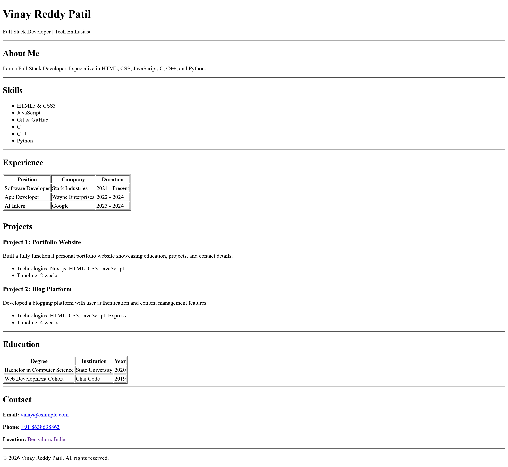

# Resume HTML

A single-page resume website built using **pure HTML**, focusing on semantic structure, clarity, and a clean layout without using CSS.

---

## 🌐 Live Demo
🔗 

---

## 🖼️ Preview

---

## 🧰 Technologies Used
- HTML5
- Semantic HTML elements
- Tables and lists only (no CSS or external libraries)

---

## ✨ Project Features
- Well-structured resume layout
- Proper use of headings, sections, tables, and lists
- Clean and readable content organization
- Responsive through default browser rendering
